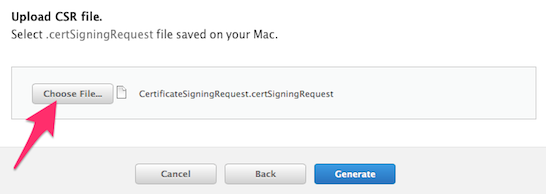

### Apple Push Notifications configuration ###

Apple Push Notification Service (APNS) is used by Incoming to remotely wake up the SDKs, and notify 
clients when new content is available. 

*Note: Remote notifications are only used for background content updates only, without user-visible 
notifications*

*Note: The SDK reverts to periodic polling in the absence of Apple Push Notifications provisioning. This 
integration step is therefore optional. Please contact your Incoming representative to discuss the relevance
of this step for your application use case.* 

If you have not already generated the Apple Push Notifications Certificate and Keys for you app, here are
some simple instructions.

#### Generate a Certificate Request ####

The first step in generating the APNS Certificate and Keys is to generate a Certificate Request, using Mac OS X.

1a) Launch the Keychain Access application using Mac OS X:

1b) Select Keychain Access -> Certificate Assistant -> Request a Certificate From a Certificate Authority:

1c) Check the 'Saved to disk' option and confirm User Email Address and Common Name. Click Continue:

1d)Save the certificate request using the suggested name and click Save. Click Done in the next screen:

We'll use this certificate request after a few more steps below.

#### Configure your app for Push Notifications ####

Next, you need to check that your app is configured for push notifications.

2a) Login to the Apple Developer Portal.

2b) In the Identifiers section, find your app and click Edit:

2c) Enable Push Notifications (for both Development and Distribution) and click Create Certificate:

_You will need to repeat steps 2c to 2f, once for the Development SSL Certificate, and again for the Production SSL Certificate._

2d) A wizard will appear. Click Continue because we've already created our Certificate Request:

2e) Click the Choose File button to locate the Certificate Request file that you have saved earlier. Click Generate and then click Done in the next screen:

2f) You can now download the SSL Certificate

__Repeat steps 2c to 2f for the Production SSL Certificate__

The Development SSL Certificate is named `aps_development.cer` and the Production SSL Certificate is named `aps_production.cer`
We'll use these certificate files in the steps below.

#### Generate APNS Certificate and Keys ####

3a) Double-click on aps_development.cer and aps_production.cer to install the certificates in your Keychain Access application.

3b) Right-click on 'Apple Development iOS Push Services' and then Export...:

Save this file as `apns-development-cert.p12`

3c) Enter the password for exporting (it can be an empty):

3d) Enter your usual admin password for your computer to confirm and finalize the export process:

__Repeat steps 3b to 3d for 'Apple Production iOS Push Services', saving the file as `apns-production-cert.p12`__

3e) Open a Terminal window, navigate to the folder containing `apns-production-cert.p12` and use the following commands to generate development Certificate and Key files in .pem format:

	openssl pkcs12 -clcerts -nokeys -out cert-production.pem -in apns-production-cert.p12 
	openssl pkcs12 -nocerts -nodes -out key-production.pem -in apns-production-cert.p12
	

__You are now ready to share the certificate files `cert-production.pem` and `key-production.pem` with your Incoming technical representative__

#### Other resources #####

 * [https://vivocha.atlassian.net/wiki/spaces/VVCJ/pages/1048822/How+to+create+the+Apple+Push+Notification+Certificate+and+Key](https://vivocha.atlassian.net/wiki/spaces/VVCJ/pages/1048822/How+to+create+the+Apple+Push+Notification+Certificate+and+Key)
 * [https://quickblox.com/developers/How_to_create_APNS_certificates](https://quickblox.com/developers/How_to_create_APNS_certificates)

Proceed to the [Widget integration](./widget-integration.html)
