iOS 10 introduced the ability to customise how user notifications are presented, through the [UserNotificationUI framework](https://developer.apple.com/reference/usernotificationsui). 

Leveraging this iOS feature, from version 1.13 and onward, the Incoming PVN SDK can play videos right into the notification UI. This feature can be accessed by users by hard-pressing a notification on 3D touch devices, or by sliding on non-3D touch devices. 

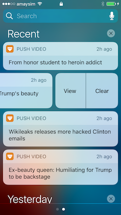      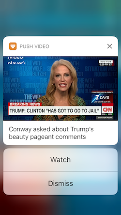

This document outlines how to implement a custom user notification UI using the Incoming Push Video SDK.

## Overview

Custom user notification UI are implemented in iOS 10 as an [_app extension_](https://developer.apple.com/library/ios/documentation/General/Conceptual/ExtensibilityPG/). 

While iOS provides the ability to add video media attachments to notifications, iOS restricts the video file attachments to under 50MB in size. To go around this limitation, the Incoming PVN SDK uses an iOS [shared container](https://developer.apple.com/library/content/documentation/General/Conceptual/ExtensibilityPG/ExtensionScenarios.html#//apple_ref/doc/uid/TP40014214-CH21-SW6) to share files between the app and the Notification Content extension.  

__Note: The following steps are quite similar to the steps needed to [configure the today widget](./widget-integration.html), so if you have already done that - you will find these can be be significantly shortened__

## Pre-requisites

To add a custom notification ui you will need: 

* XCode 8 or above
* Access to the apple developer portal for your app ID
* Your app project, [configured to use the Incoming Push Video Notification SDK](./).

## Apple developer portal configuration ##

The notification UI is an iOS 10 app extension of the “Notification Content” type (c.f. [https://developer.apple.com/app­extensions/](https://developer.apple.com/app­extensions/))​.
Its code therefore reside in a separate target under your XCode project, with a separate Bundle ID (‘app id’). You must therefore configure two bundle ID in the apple developer portal: one for your application and one for the widget. In addition, the SDK and the widget must be part of the same apple app group, to be able to communicate and exchange data (c.f. the “Sharing Data with your Container app” section at [https://developer.apple.com/library/ios/documentation/General/Conceptual/ExtensibilityPG/Ext ensionScenarios.html](https://developer.apple.com/library/ios/documentation/General/Conceptual/ExtensibilityPG/Ext ensionScenarios.html)).

### Create the bundle IDs ###

Log in the Apple developer portal, and click __Certificates, Identifiers and Profiles__, then __Identifiers__ under __App Ids__.

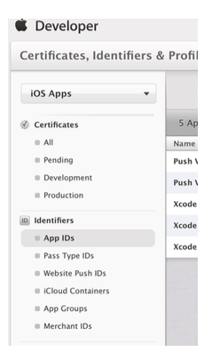

Create an app id in the form `com.yourcompany.yourapp.notificationui`. 
You should therefore have three app IDs with the following structure:

 * `com.yourcompany.yourapp` 
 * `com.yourcompany.yourapp.widget`
 * `com.yourcompany.yourapp.notificationui`

Note: The host application cannot use a wildcard app id (in the form com.yourcompany.*), as the Incoming Push Video Notification requires push notifications

### Create the app group ### 

The notification UI and host application use a shared filesystem area to communicate and exchange data. To enable this shared filesystem, the containing app's main target and the widget / notification content extension bundle IDs need to be part of the same "App Group".

__Note: This app group should be the same used for the widget, so it you have already created an app group for the Today widget, you may want to skip this section__

To create the app group, still in the apple developer portal, click Identifiers / App Groups / +. Name it e.g. `group.com.yourcompany.yourapp` (Apple recommends that the group name should start with ‘group’). 
	
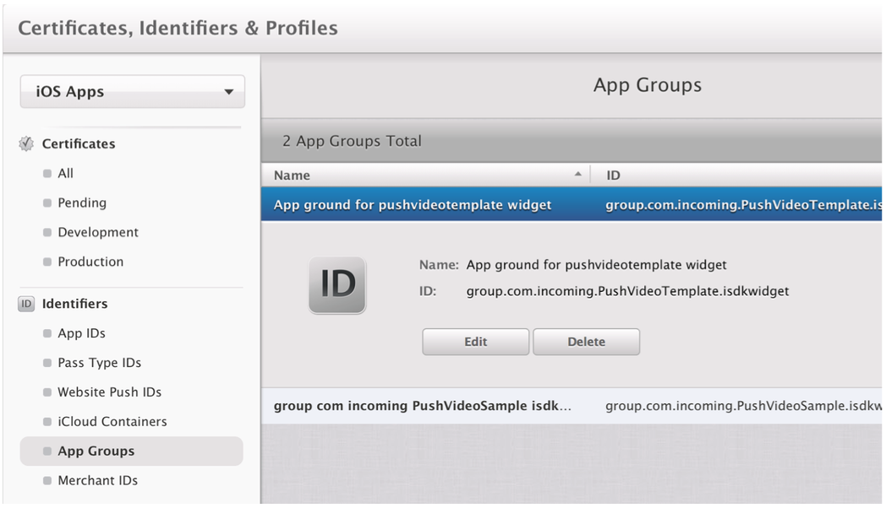

### Configure app IDs to use the app security group ###

In the Apple Developer portal, select “Identifiers” / "App IDs” and enable the App Group service for the three app IDs previously created, by clicking the app ID, then ‘Edit’ at the bottom, then toggle the ‘App Groups’ service, click “edit” and select the app group created in the previous step.

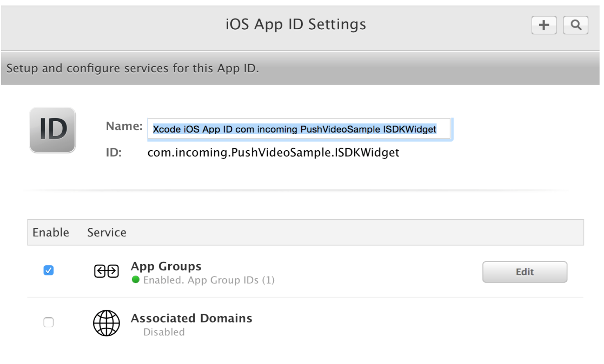

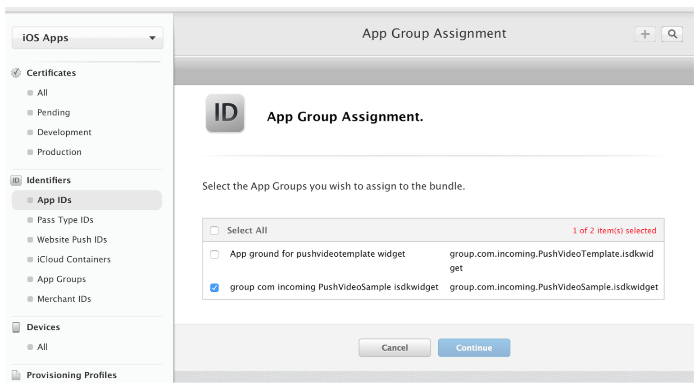

### Re-generate provisioning profiles ###

Provisioning profiles must be re­generated so that the app group service is enabled when building your application. In the Apple Developer Portal, go to “Provisioning Profiles”,and generate a provisioning profile __for each app ID__.

## XCode project configuration

### Create the Notification Content target
 
Add a new target to your project, of type _Notification Content_: Select _Add Target_ from the _Editor_ menu, and choose the _Notification Content_ type. 

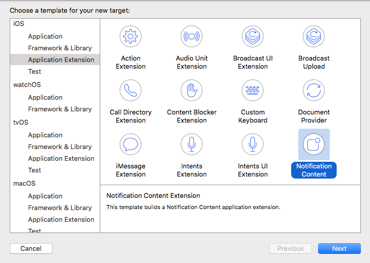

### Configure the Notification Content Target

Configure the new target's notification category. Select your target, navigate to the _Info_ Pane, and open the _NSExtension_ property, then _NSExtensionAttribute_. Change the _UNNotificationExtensionCategory_ value to `isdk-notifications`

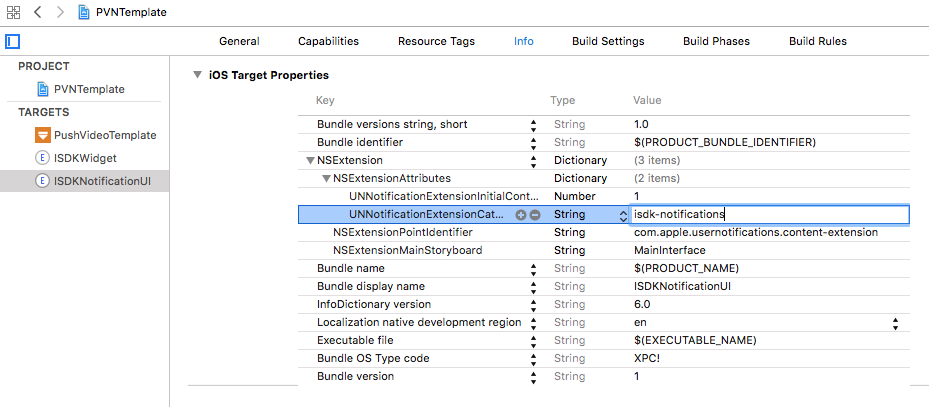

Configure the target's initial aspect ratio. If your video content is mostly 16:9 ratio, configure the `UNNotificationExtensionInitialContentSizeRatio` value to 9:16, i.e. 0.5625 

In the XCode project navigator, select your project, then your Notification Content target, and select the Capability pane. Scroll down to “App Group”, and select the app group previously created in the Apple Developer Portal. If you don’t see your app group, click the reload button (next to the ‘+’ button). Note that all Incoming-related targets (main app, Widget, and Notification Content) must be configured with the same app group capability. 
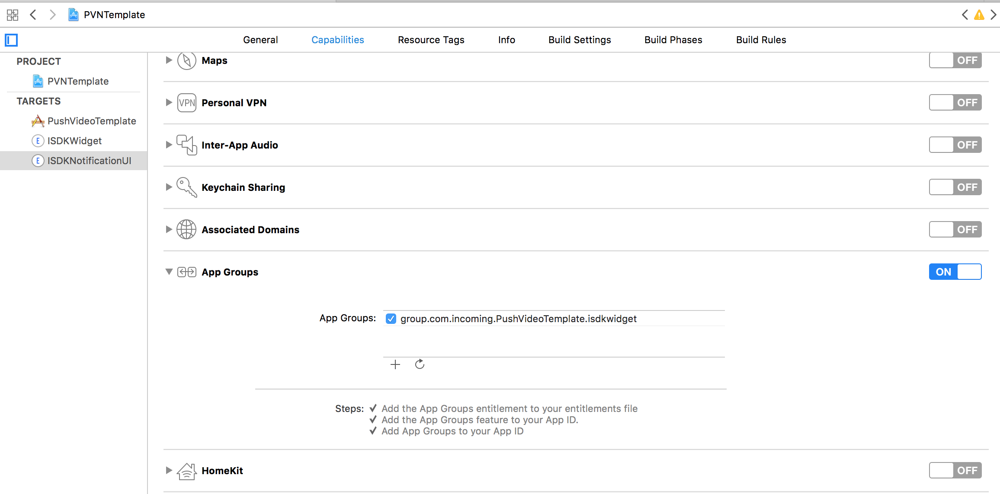

### Import the Incoming PVN SDK notification UI code

Drag the incoming-ios-notificationui folder from the incoming distribution folder over onto your project. When prompted, add the content to your newly created Notification Content target. 
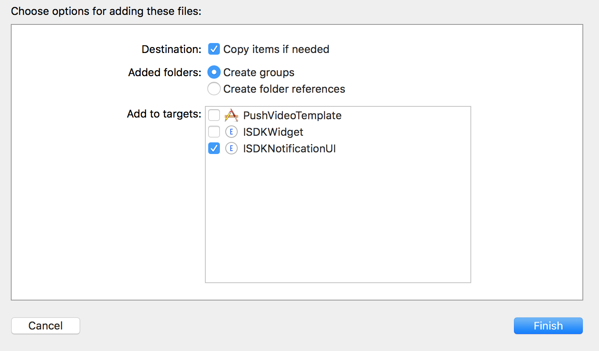

### Configure the Notification Content target storyboard

In the XCode project navigator, select your project, then your Notification Content target, and select the General pane. Scroll down to the 'Deployment Info' section, and set the main interface to the ISDKNotification.storyboard. 

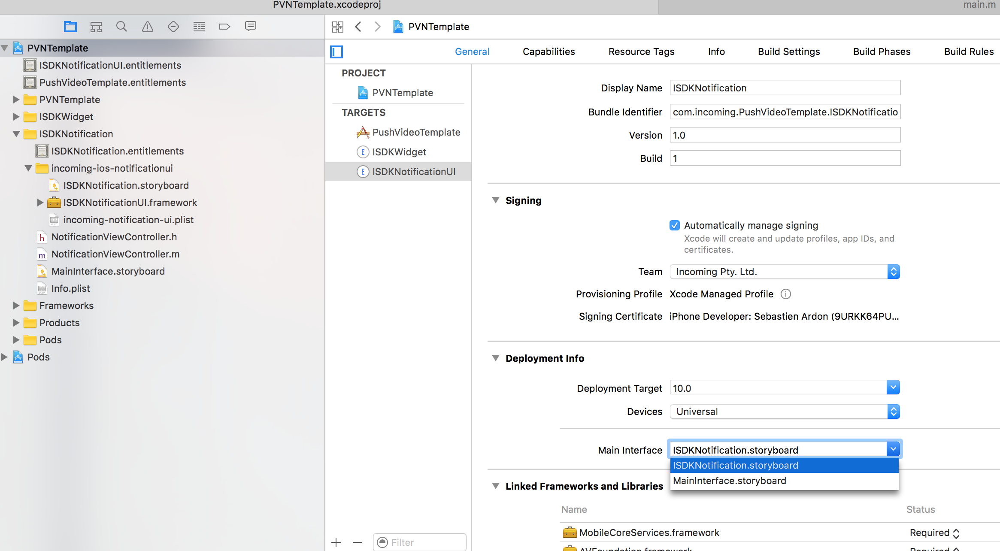

### Set up Frameworks 

Select your target, navigate to the _Build Phases_ pane, and add the _AVFoundation_ and _MobileCoreServices_ framework. 
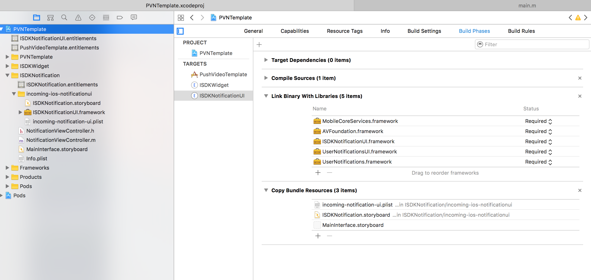

### Configure the Incoming Push Notification SDK

This step ensures that the Incoming PVN SDK uses the right app group. If you have already configured the widget, you have already done it. Edit the _incoming-­ios-­sdk.plist_ file in your project, and add this entries:

 * `security_application_group`​ set to your group name, e.g. group.com.yourcompany.yourapp

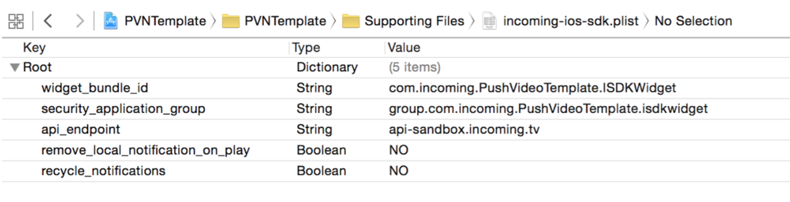

Additionally, configure the _incoming--notification--ui.plist_ file in your project, and add the same entry. 

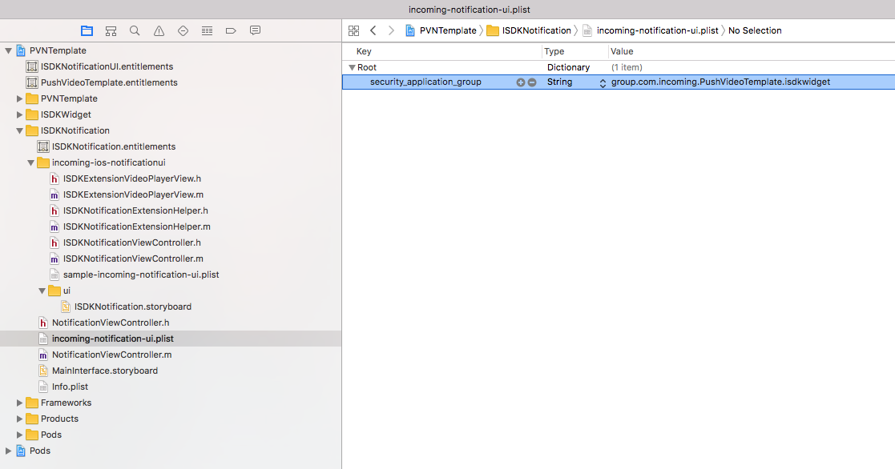

### Configure target provisioning profiles

This step ensure that each target embeds the right provisioning profile. In both main app and widget target’s build settings, scroll down to the “Code Signing” and check that the “Provisioning Profile” setting is set to “Automatic”. Alternatively, select the provisioning profiles previously created in the Apple Developer Portal.

Proceed to the [FAQ](./faq.html)

