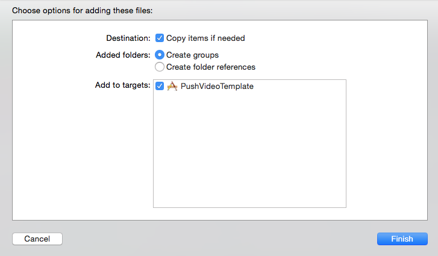
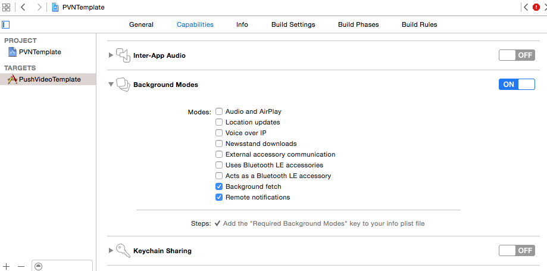
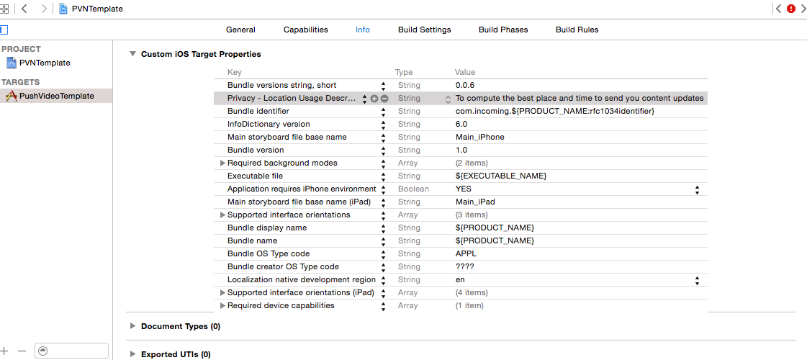
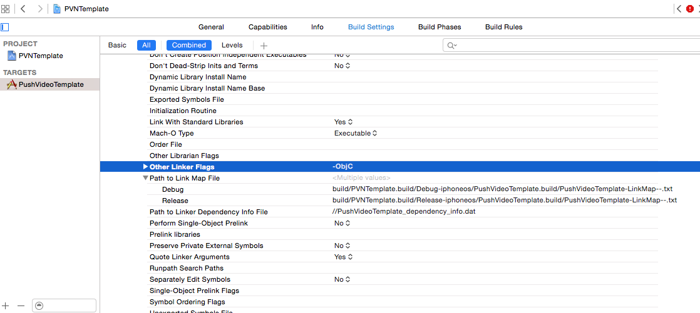

### Import the iOS SDK zip ###

The PVN SDK distribution zip can be downloaded from your project in the Incoming control panel
(contact your Incoming media representative for access).

The distribution zip file contains a directory named incoming-ios-sdk, which itself contains:

* the Incoming SDK Framework
* the Incoming SDK Resource Bundle
* a sample configuration file sample-incoming-ios-sdk.plist
* README and CHANGELOG

The distribution zip also contains. 
* incoming-ios-widget: the widget target helper which allows to play Incoming video right in the Notification Center
* incoming-ios-notificationui: the notification UI, which allows to play Incoming video right in the Notifications, on iOS 10
Integration for these two items are covered in separate pages, c.f. [Today widget integration](./widget-integration.html) and [Custom notification UI (iOS 10)](./custom-notification-ui.html)

To add the Incoming PVN SDK to your project, drag and drop the incoming-ios-sdk onto your XCode project. Tick "Copy items if needed".

### Configure framework dependencies ###

(if your project is in Swift, you can skip this phase) 
Go into your app’s target’s Build Phases screen and add the following frameworks to
the *Link Binary With Libraries* section

	* AVFoundation.framework
	* MediaPlayer.framework
	* SystemConfiguration.framework
	* CoreMotion.framework
	* CoreTelephony.framework
	* CoreData.framework
	* CoreMedia.framework
	* MediaPlayer.framework
	* MobileCoreServices.framework
	* SystemConfiguration.framework
	* Foundation.framework
	* CoreImage.framework
	* Accelerate.framework
	* UIKit.framework
	* libz.dylib
	* NotificationCenter.framework (status can be set to “Optional” if you want to support
iOS7

### Configure Background Modes ###

Using XCode, configure the application background modes:
 * click on your app target, then select `Capabilities`.
 * Turn on `Background Modes`
 * In Background Modes, enable `Background fetch and Remote Notifications`

In your app Info pane, add the location data collection purpose, by adding a new key for `Privacy 
- Location Usage Description` to e.g. _To compute the best place and time to send you content update_
Note this step is optional, if you wish to enable location data usage in the PVN SDK.

### Configure ATS

iOS 8 introduced [App Transport Security](https://developer.apple.com/library/content/documentation/General/Reference/InfoPlistKeyReference/Articles/CocoaKeys.html), which must be configured if your content server exposes assets over plain HTTP. 

Start by choosing the main target of your app, select the Info tab, and add the 'App Transport Security Settings' key, with a subkey 'Allow Arbitrary Loads' to YES. 

### Set linker flags ###

Enable a linker flag that allows the use of categories in the Incoming SDK static library. 
Start by choosing the main target for your app, selecting the Build Settings tab, and then
 search for `other linker flags`. Under Other Linker Flags, add the `-ObjC`.

### Add bridging header ###

If your project doesn't use swift, you may skip to the next step. Swift users must add [this 
bridging header](https://github.com/incoming-inc/ios-template-app/blob/master/Swift/ISDK-Bridging-Header.h) 
to their project to be able to use the Incoming PVN sdk.

### Add code to your app delegate ###

The host application delegate must to forward several calls from the operating system to the SDK. 
These are all implemented in the template application and can be conveniently copied from there. 

Take a look into the sample application’s delegate code:

 * Objective-C [https://github.com/incoming-inc/ios-template-app/blob/master/Objective-C/PVNTemplate/PVTAppDelegate.m](https://github.com/incoming-inc/ios-template-app/blob/master/Objective-C/PVNTemplate/PVTAppDelegate.m)
 * Swift [https://github.com/incoming-inc/ios-template-app/blob/master/Swift/PVNSampleSwift/AppDelegate.swift](https://github.com/incoming-inc/ios-template-app/blob/master/Swift/PVNSampleSwift/AppDelegate.swift
)

The minimum code to add to your application delegate is as follows. 

#### Objective-C ####

	#import "ISDKAppDelegateHelper.h"
	...

	- (BOOL)application:(UIApplication *)application didFinishLaunchingWithOptions:(NSDictionary *)launchOptions
	{
		[ISDKAppDelegateHelper application:[UIApplication sharedApplication] didFinishLaunchingWithOptions:launchOptions];

		// this registers for remote notifications on iOS > 8. It must be called
		// at some stage in your app initialization. Note that this method will never
		// result in a notification permission dialog being shown to the user. 
		[ISDKAppDelegateHelper registerForRemoteNotifications];

		// This will pop-up the OS permission dialog, feel free to
		// integrate them differently in your workflow
		[ISDKAppDelegateHelper registerForNotifications];

		// the two following calls are optional. They enable location and motion data collection
		// which improves the timing prediction of Push Video Notifications
		// calling these methods may also result in the OS permission dialog being presented
		// to the user.
		[ISDKAppDelegateHelper registerForMotionActivity];
		[ISDKAppDelegateHelper registerForLocationUpdates];

		return YES;
	}

	- (BOOL)application:(UIApplication *)application openURL:(NSURL *)url sourceApplication:(NSString *)sourceApplication annotation:(id)annotation
	{
		if ([ISDKAppDelegateHelper handleOpenURL:url sourceApplication:sourceApplication annotation:annotation] == NO){
			// perform handling of your app URL here
		}
		return YES;
	}

	- (void) application:(UIApplication *)application performFetchWithCompletionHandler:(void (^)(UIBackgroundFetchResult))completionHandler{
		[ISDKAppDelegateHelper application:application performFetchWithCompletionHandler:completionHandler];
	}

	- (void)application:(UIApplication *)application handleEventsForBackgroundURLSession:(NSString *)identifier completionHandler:(void (^)())completionHandler
	{
		[ISDKAppDelegateHelper application:application handleEventsForBackgroundURLSession:identifier completionHandler:completionHandler];
	}

	- (void)application:(UIApplication *)application didRegisterForRemoteNotificationsWithDeviceToken:(NSData *)deviceToken
	{
		[ISDKAppDelegateHelper application:application didRegisterForRemoteNotificationsWithDeviceToken:deviceToken];
	}

	- (void)application:(UIApplication *)application didFailToRegisterForRemoteNotificationsWithError:(NSError *)error
	{
		[ISDKAppDelegateHelper application:application didFailToRegisterForRemoteNotificationsWithError:error];
	}

	- (void)application:(UIApplication *)application didReceiveRemoteNotification:(NSDictionary *)userInfo
	fetchCompletionHandler:(void (^)(UIBackgroundFetchResult))completionHandler
	{
		[ISDKAppDelegateHelper application:application didReceiveRemoteNotification:userInfo fetchCompletionHandler:completionHandler];
	}

	- (void)application:(UIApplication *)application didReceiveRemoteNotification:(NSDictionary *)userInfo
	{
		[ISDKAppDelegateHelper application:application didReceiveRemoteNotification:userInfo];
	}

	- (void)application:(UIApplication *)application didReceiveLocalNotification:(UILocalNotification *)notification
	{
		[ISDKAppDelegateHelper application:application didReceiveLocalNotification:notification];
	}

	- (void)application:(UIApplication *)application handleActionWithIdentifier:(NSString *)identifier forLocalNotification:(UILocalNotification *)userInfo completionHandler:(void (^)())completionHandler {
		[ISDKAppDelegateHelper application:application handleActionWithIdentifier:identifier forLocalNotification:userInfo completionHandler:completionHandler];
	}

	- (void)application:(UIApplication *)application didRegisterUserNotificationSettings:(UIUserNotificationSettings *)notificationSettings
	{
		[ISDKAppDelegateHelper application:application didRegisterUserNotificationSettings:notificationSettings];
	}
	
	
	- (void)userNotificationCenter:(UNUserNotificationCenter *)center didReceiveNotificationResponse:(UNNotificationResponse *)response withCompletionHandler:(void (^)())completionHandler
	{
	    [ISDKAppDelegateHelper userNotificationCenter:center didReceiveNotificationResponse:response withCompletionHandler:^(BOOL processed) {
	        if (!processed)
	        {
	            // handle host app notification response.
	        }
	        if (completionHandler)
	        {
	            completionHandler();
	        }
	    }];
	}

	- (void)userNotificationCenter:(UNUserNotificationCenter *)center
	       willPresentNotification:(UNNotification *)notification
	         withCompletionHandler:(void (^)(UNNotificationPresentationOptions options))completionHandler
	{
	    [ISDKAppDelegateHelper userNotificationCenter:center willPresentNotification:notification withCompletionHandler:^(BOOL processed) {
	        if (!processed)
	        {
	            // handle host app notification
	            // and call completion handler
	        } else {
	            completionHandler(UNNotificationPresentationOptionNone);
	        }
	    }];
	}

#### Swift ####

	import UIKit
	import UserNotifications

	@UIApplicationMain
	class AppDelegate: UIResponder, UIApplicationDelegate, UNUserNotificationCenterDelegate {

	    var window: UIWindow?

	    func application(application: UIApplication, didFinishLaunchingWithOptions launchOptions: [NSObject: AnyObject]?) -> Bool {

	        // ISDK method forward
	        ISDKAppDelegateHelper.application(application, didFinishLaunchingWithOptions:launchOptions!)

	        // Register for remote notifications. The Incoming PVN uses silent remote notifications for content updates. 
	        // You must call this method at some stage for the push video service to operate correctly. 
	        ISDKAppDelegateHelper.registerForRemoteNotifications()

	        // This will pop-up the OS permission dialog, feel free to
	        // integrate them differently in your workflow
	        ISDKAppDelegateHelper.registerForNotifications()

	        // set UNNUserNotificationCenter delegate
	        if #available(iOS 10.0, *) {
	            let notificationCenter = UNUserNotificationCenter.currentNotificationCenter()
	            notificationCenter.delegate = self
	        }

	        // the two following calls are optional. They enable location and motion data collection
	        // which improves the timing prediction of Push Video Notifications.
	        // Calling these methods may result in the OS permission dialog being presented
	        // to the user.
	        ISDKAppDelegateHelper.registerForLocationUpdates()
	        ISDKAppDelegateHelper.registerForMotionActivity()

	        // <insert your app initialization code here>
	        return true
	    }

	    func application(application: UIApplication, openURL url: NSURL, sourceApplication: String?, annotation: AnyObject) -> Bool {

	        // ISDK method forward
	        if (ISDKAppDelegateHelper.handleOpenURL(url, sourceApplication: sourceApplication!, annotation: annotation) == false)
	        {
	            // perform handling of your app URL here

	        }
	        return true
	    }

	    func application(application: UIApplication, performFetchWithCompletionHandler completionHandler: (UIBackgroundFetchResult) -> Void) {

	        // ISDK method forward
	        ISDKAppDelegateHelper.application(application, performFetchWithCompletionHandler:completionHandler)

	    }

	    func application(application: UIApplication, handleEventsForBackgroundURLSession identifier: String, completionHandler: () -> Void) {

	        // ISDK method forward
	        ISDKAppDelegateHelper.application(application, handleEventsForBackgroundURLSession: identifier, completionHandler: completionHandler)

	    }

	    func application(application: UIApplication, didRegisterForRemoteNotificationsWithDeviceToken deviceToken: NSData) {

	        // ISDK method forward
	        ISDKAppDelegateHelper.application(application, didRegisterForRemoteNotificationsWithDeviceToken: deviceToken)

	    }

	    func application(application: UIApplication, didFailToRegisterForRemoteNotificationsWithError error: NSError) {

	        // ISDK method forward
	        ISDKAppDelegateHelper.application(application, didFailToRegisterForRemoteNotificationsWithError:error)
	    }

	    func application(application: UIApplication, didReceiveRemoteNotification userInfo: [NSObject : AnyObject]) {

	        // ISDK method forward
	        if ISDKAppDelegateHelper.application(application, didReceiveRemoteNotification: userInfo) == false
	        {
	            // process your app's remote notification here

	        }
	    }

	    func application(application: UIApplication, didReceiveLocalNotification notification: UILocalNotification) {

	        // ISDK method forward
	        if (ISDKAppDelegateHelper.application(application, didReceiveLocalNotification: notification) == false)
	        {
	            // process your app local notification here

	        }
	    }

	    func application(application: UIApplication, handleActionWithIdentifier identifier: String?, forLocalNotification notification: UILocalNotification, completionHandler: () -> Void) {

	        // ISDK method forward
	        if (ISDKAppDelegateHelper.application(application, handleActionWithIdentifier: identifier, forLocalNotification: notification, completionHandler: completionHandler) == false)
	        {
	            // process your app local notification here

	            // call completion handler
	            completionHandler();
	        }
	    }

	    func applicationWillResignActive(application: UIApplication) {

	        // ISDK method calls

	        // Sent when the application is about to move from active to inactive state. This can occur for certain types of temporary interruptions (such as an incoming phone call or SMS message) or when the user quits the application and it begins the transition to the background state.
	        // Use this method to pause ongoing tasks, disable timers, and throttle down OpenGL ES frame rates. Games should use this method to pause the game.

	    }

	    func applicationDidEnterBackground(application: UIApplication) {
	        // Use this method to release shared resources, save user data, invalidate timers, and store enough application state information to restore your application to its current state in case it is terminated later.
	        // If your application supports background execution, this method is called instead of applicationWillTerminate: when the user quits.
	    }

	    func applicationWillEnterForeground(application: UIApplication) {
	        // Called as part of the transition from the background to the inactive state; here you can undo many of the changes made on entering the background.
	    }

	    func applicationDidBecomeActive(application: UIApplication) {
	        // Restart any tasks that were paused (or not yet started) while the application was inactive. If the application was previously in the background, optionally refresh the user interface.
	    }

	    func applicationWillTerminate(application: UIApplication) {
	        // Called when the application is about to terminate. Save data if appropriate. See also applicationDidEnterBackground:.
	    }

	    @available(iOS 10.0, *)
	    func userNotificationCenter(center: UNUserNotificationCenter, didReceive response: UNNotificationResponse, withCompletionHandler completionHandler: () -> Void) {

	        // forward to ISDK
	        ISDKAppDelegateHelper.userNotificationCenter(center, didReceiveNotificationResponse: response) { (processed: Bool) -> Void in
	            if !processed {
	                // this notification is not ISDK, handle your app notification response here as needed
	            }

	            completionHandler()
	        }
	    }

	    @available(iOS 10.0, *)
	    func userNotificationCenter(center: UNUserNotificationCenter, willPresent notification: UNNotification, withCompletionHandler completionHandler: (UNNotificationPresentationOptions) -> Void) {
	        ISDKAppDelegateHelper.userNotificationCenter(center, willPresentNotification: notification) { (processed: Bool) -> Void in
	            if !processed {
	                // this notification is not ISDK
	                // process your app notification here
	                // and call the completion handler if needed ..
	            }
	        }
	    }

	}
	

Once done, you may want to proceed to the [SDK settings configuration](./sdk-settings.html)
